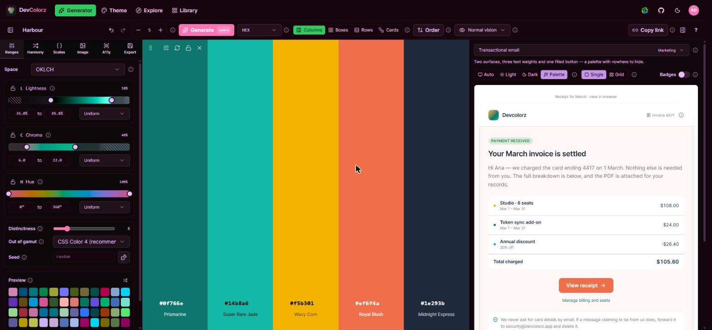
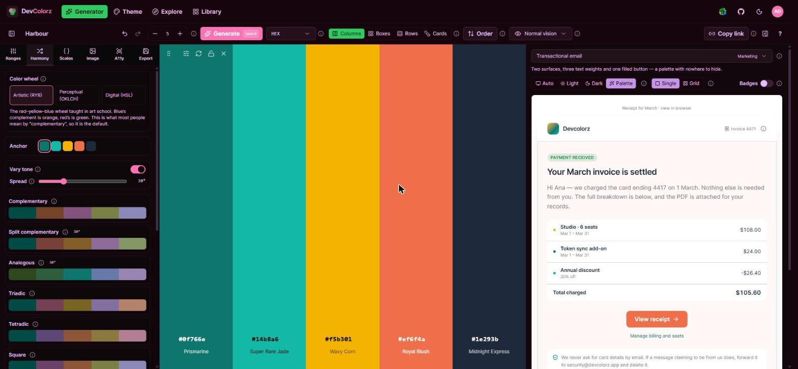
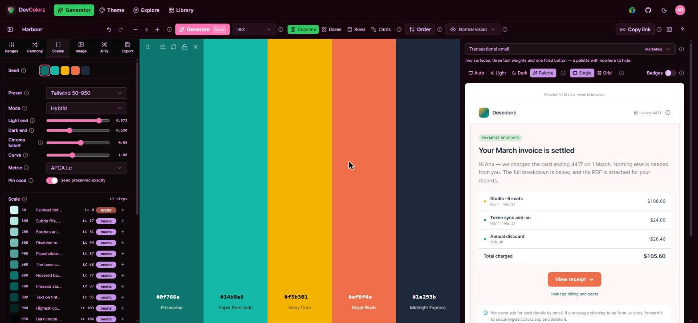
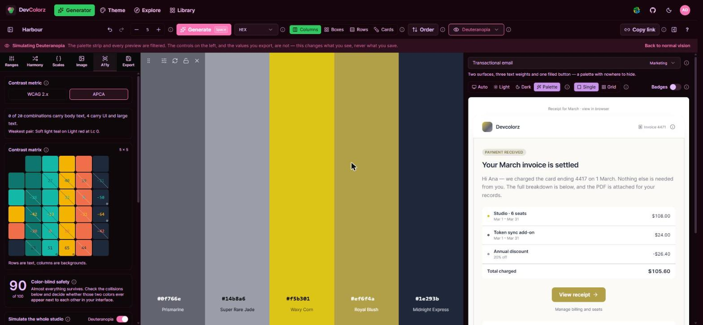
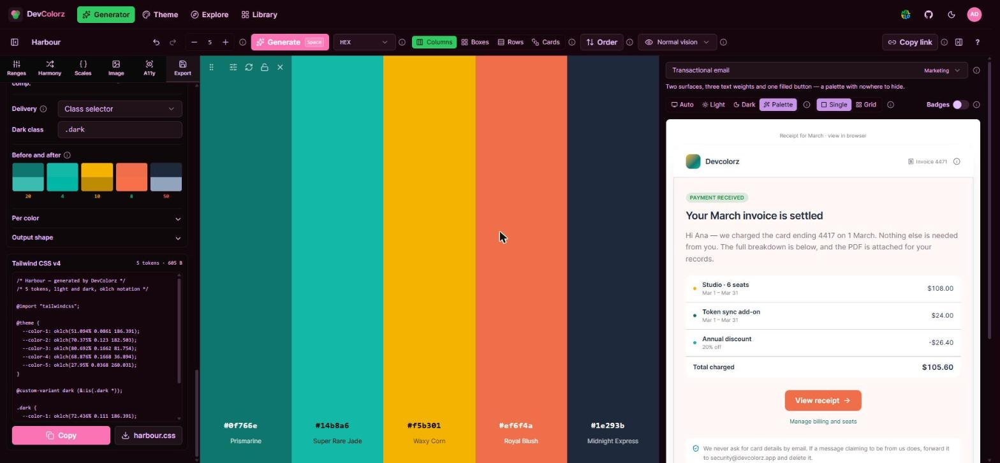
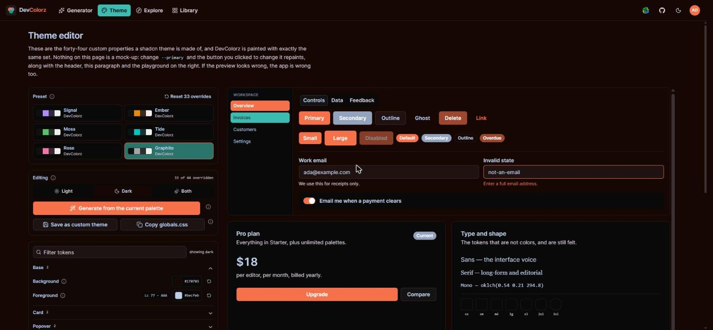
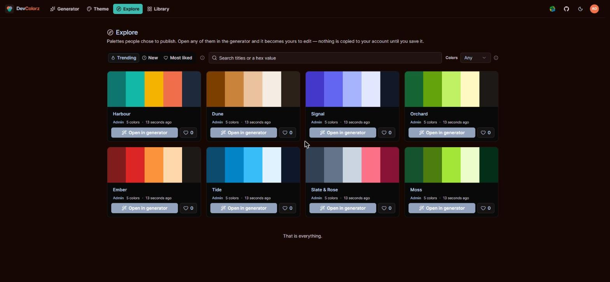
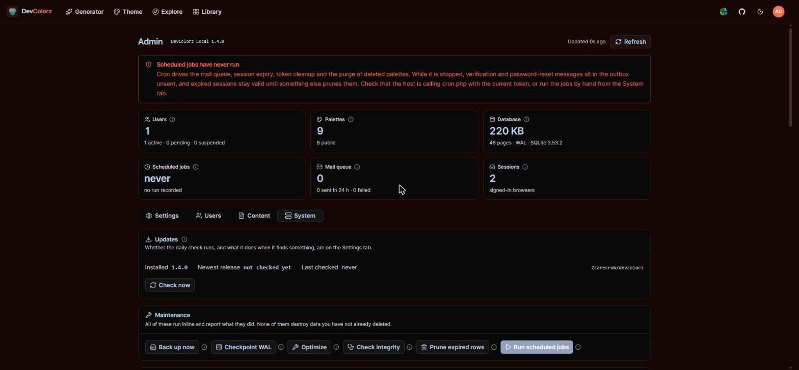

<div align="center">

# DevColorz

**A colour-system studio you can host yourself.**

Generate palettes inside constraints you define, judge them in real interfaces,
and export them as production-ready design tokens.

### [Try it → devcolorz.fabula.vision](https://devcolorz.fabula.vision)

No account needed. The generator, the theme editor and every export work
straight away — an account only adds saving palettes to a library.

[Install](docs/INSTALL.md) · [User guide](docs/GUIDE.md) · [Releases](../../releases)

[](LICENSE)


</div>

---

Upload it to any shared host with PHP and it runs. No Composer, no Node on the
server, no database to provision, no build step. Unzip, upload, open the site.



*The generator. You describe a region of a colour space on the left — lightness
35–85%, chroma up to 22, any hue, and no two results closer than 8 perceptual
units — and every palette lands inside it. On the right the palette is drawn
into a real transactional email, not a row of squares.*

## A tour in eight screens

### Ranges — say what you want, then roll

*Shown in the screenshot above.* The left panel is the constraint, not a filter
applied afterwards. Lock a
channel, narrow it, choose how values are distributed across it, and set how
far apart two colours must be before both are allowed. Type a seed and the same
palette comes back every time.

### Harmony — the schemes, on three different wheels



*Complementary, split, analogous, triadic, tetradic and square — each previewed
before you apply it. The wheel matters: red's complement is green on the RYB
wheel taught in art school and cyan on the HSL one your CSS uses, so DevColorz
offers both rather than picking for you.*

### Scales — a tonal ramp per colour, graded as you build it



*Pick a preset — Tailwind 50–950, Material tones, Radix steps — and each step
is generated in OKLCH and then measured. The badge beside every step says
whether it meets the contrast target you chose, so the ramp is judged while it
is made rather than audited later.*

### Accessibility — as an input, not a report



*Every pair in the palette, judged by WCAG 2.x and APCA at once. The score
below rates how much of the palette survives colour-vision deficiency, and the
switch at the bottom filters the entire studio — palette, previews and all — so
you see what a deuteranopic visitor sees. The banner is there because the
values you export never change; only what is on screen does.*

### Export — sixteen formats, and the awkward questions answered



*CSS custom properties, Tailwind v3 and v4, SCSS, Less, JSON, W3C design
tokens, TypeScript, CSV, SVG, GIMP, Android, SwiftUI, Flutter, Jetpack Compose,
a shadcn registry item. Naming, notation, opacity ladders and six different
light-to-dark strategies are all yours to set — each explained, including why
the naive HSL flip everyone tries first does not work.*

### Theme editor — the app is the preview



*Forty-four shadcn custom properties, and DevColorz is painted with exactly the
same set. This screenshot is the app after "Generate from the current palette":
the header, the buttons and the panels are all wearing the Harbour palette. If
the preview looks wrong, the app is wrong — there is no mock-up to disagree
with.*

### Explore — palettes people chose to publish



*Public palettes, sorted by trending, newest or most liked, searchable by title
or by hex. Open any one in the generator and it is yours to edit; nothing is
copied to your account until you save it.*

### Admin — one console for the whole instance



*Users, content moderation, mail, scheduled jobs, a self-test that checks your
server is not exposing anything it should not — and updates, which this
installation can check for and apply to itself.*

## What makes it different

**Constrained randomness, not a slot machine.** Other tools give you a space
bar. DevColorz lets you describe the region of a colour space you want — per
channel, with wrap-around hue, a distribution, and a minimum perceptual
distance between results — and every roll lands inside it. Seeded, so a palette
is reproducible from its link.

**OKLCH throughout.** Every colour is stored perceptually and only serialised
at the edges. That is what makes "10% lighter" mean the same thing for yellow
as for blue, and it is why the scales, the dark-mode derivation and the
accessible-pair solving produce usable results rather than approximately-right
ones.

**Previews that are assembled, not decorated.** Eighteen templates — landing
pages, dashboards, mobile screens, a UI kit, chart sets. A palette of N colours
is mapped onto each template's semantic slots by a solver, so an arbitrary
palette of 2 or 40 colours renders a legible interface instead of a random one.
Colours the solver had to invent are flagged as such.

**Accessibility as an input.** WCAG 2.x and APCA side by side, a contrast
matrix over every pair, colour-vision simulation applied in linear light — as
the source paper defines it, which most implementations get wrong — and a
collision detector for pairs that stay distinct in normal vision but collapse
under deuteranopia.

**Export that answers the real questions.** Notation, variable naming,
transparent variants (opacity ladder, solved alpha, or neutral overlay), tonal
scales, and light/dark derivation with six inversion strategies — each one
explained, including why the naive HSL flip everybody tries first does not
work. Sixteen output formats, from CSS custom properties to a shadcn registry
item.

## Install

Download the latest ZIP from [releases](../../releases), unzip, upload the
contents to your document root, and open the site. The setup wizard checks your
server and walks you through the rest.

Full details, including nginx configuration and troubleshooting, in
**[docs/INSTALL.md](docs/INSTALL.md)**.

## Develop

```bash
npm install
npm run dev        # Vite on :5273
npm run test       # engine unit tests
npm run typecheck
```

The backend needs PHP 8.2+, or Docker:

```bash
docker run --rm -d --name dcz -p 8080:8080 \
  -v "$PWD:/w" -w /w php:8.4-cli \
  php -S 0.0.0.0:8080 -t server scripts/dev-router.php

BASE=http://127.0.0.1:8080 STORAGE=server/storage sh scripts/smoke-api.sh
```

`scripts/dev-router.php` reproduces the two `.htaccess` rules that matter:
`/api/*` falls through to the front controller, and `storage/` is refused.

To build a release:

```bash
npm run build      # typecheck + Vite build
npm run bundle     # assemble deploy/ from dist/ + server/
```

`deploy/` is the tree that ships. `npm run deploy` mirrors it over FTP if you
set `DEVCOLORZ_FTP_HOST` / `_USER` / `_PASSWORD`; it never touches the remote
`storage/` or `config.php`.

## Layout

```
app/                    Vue 3 SPA
  lib/color/            the colour engine — no Vue, no DOM, unit-tested
  lib/theme/            the 44-token shadcn/tweakcn contract
  lib/export/           token graph and output emitters
  lib/palette/          document format, URL codec, layout packing
  components/           studio, generator, preview, export, a11y, admin
  stores/               palette, studio, theme, session
server/                 PHP backend, deployed alongside the built SPA
  api/lib/              framework-free application classes
  api/routes/           endpoint handlers
  cron.php              scheduled work, token-guarded
scripts/                build, bundle, deploy, code generation
docs/                   install guide, user guide, generated API reference
```

The colour engine never imports Vue and Vue never imports culori. That boundary
is load-bearing: it is why the engine can be tested as plain functions, and why
a hue drag stays at 60fps.

## Notes for the curious

Things that look like mistakes and are not:

- **Sessions are ours, not PHP's.** `session.save_path` defaults to a
  world-readable `/tmp` on shared hosting. The cookie carries a raw 256-bit id;
  the table stores only its SHA-256, so a leaked backup cannot be replayed.
- **`BEGIN IMMEDIATE`, never `PDO::beginTransaction()`.** A deferred
  transaction that upgrades from read to write returns `SQLITE_BUSY`
  immediately, ignoring `busy_timeout`.
- **Parameters are bound by type.** `PDOStatement::execute($array)` binds
  everything as a string, and SQLite ranks every INTEGER below every TEXT — so
  `last_seen_at + ? <= ?` silently matches every row.
- **WAL is verified, not assumed.** It does not work over NFS, and the pragma
  returns the mode in effect rather than the mode requested.
- **Sign-in reveals nothing.** Wrong password, locked account and unknown
  address return the same 401, and a missing account still burns a dummy
  password hash so the timing matches.
- **The database filename starts with `.ht`.** Stock Apache refuses to serve it
  even if `AllowOverride` is off and the deny rules never load.
- **Deprecations are logged, never thrown.** PHP 8.5 deprecated `curl_close()`;
  an error handler that promotes notices to exceptions turns a language point
  release into a 500.

## Contributing

Issues and pull requests are welcome. Two house rules:

1. The colour engine stays free of Vue and of DOM APIs, and changes to it come
   with tests.
2. Comments explain *why*, not *what*.

`docs/API-DIGEST.md` is generated from the compiler's own declarations by
`npm run digest` — do not edit it by hand.

## The link in the header

Beside the GitHub mark there is a link to [MILELO](https://www.milelo.de/), a
primary school in Arusha, Tanzania where lessons and meals cost the families
nothing. It is run locally, funded through the German non-profit Education is
Light e.V., and it has nothing to do with colour — it is there because the
person who wrote this supports it, and a header is cheap.

## Licence

[MIT](LICENSE). Free for any use, including commercial, with no attribution
required beyond keeping the licence notice.

Third-party components and data — colour names, the colour-vision matrices, the
APCA algorithm — are credited in [THIRD-PARTY.md](THIRD-PARTY.md).
